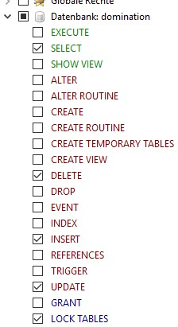

# 如何安装数据库

> 这个简单的自述文件基于免费开源的 MySql 数据库 MariaDB

### 1、下载所需文件：

#### A. [MariaDB](https://mariadb.org/download/) 

#### B1. [extDB3](https://github.com/SteezCram/extDB3)

#### B2. [InterceptDB](https://github.com/intercept/intercept-database)
> InterceptDB 需要[CBA](https://forums.bohemia.net/forums/topic/168277-cba-community-base-addons-arma-3/)

### 2、安装 MariaDB

> 不要忘了从 MariaDB 安装 HeidiSQL 工具

### 3、数据库连接文件配置（两种方式）

#### A、extDB3

> 对于 extDB3，请将 @extDB3（从 extDB3 下载，而不是从7z）安装到 Arma3 服务器文件夹（不要忘记将 tbbmalloc dll 文件从 extDB3下 载复制到 Arma3 服务器文件夹或主机的 Arma3 游戏文件夹）。

#### B、InterceptDB

> 对于 InterceptDB，将 @InterceptDB（从 InterceptDB 下载，而不是从7z）复制到 Arma3 服务器文件夹中。我们也需要CBA，所以别忘了这一点。

### 4、连接数据库

> 一旦安装了 MariaDB，打开 HeidiSQL 并以 root 身份连接到数据库（root密码在 MariaDB 安装期间设置）。

### 5、创建数据库

> 这将创建 Domination 的数据库。

* 选择文件 -> 执行SQL 并选 Domination.sql 你可以在 7z 文件中找到的文件（File -> Execute SQL）

* 现在打开工具中的用户管理（仍然是 HeidiSQL）并创建一个新用户。这个新用户的名字由你决定。只需确保添加控制对象（右边的绿色按钮，新对象？）并授予用户以下权限/凭据：



### 6、配置数据库连接信息（两种方式）

#### A、extDB3

* 复制 `domination-custom.ini ` 文件从 `@extDB3\sql_custom` 自定义文件夹下载到 Arma3 服务器目录中的 `@extDB3\sql_custom` 自定义文件夹。

* 执行相同的操作: `@extDB3` 文件夹中 `extdb3-conf.ini` 文件 复制到 Arma3 服务器目录中的 `@extDB3` 文件夹中。

* 打开 `extdb3-conf.ini` 文件 在带有文本编辑器的 Arma3 服务器目录中的 `@extDB3` 文件夹中，添加控制用户和控制用户的密码（使用 HeidiSQL 设置的 MariaDB 中的密码。不要使用 root 用户和密码）：

```text
[Domination]
IP = 127.0.0.1
Port = 3306
Username = yourdbuserwithaccesstodominationdb
Password =  thepasswordofthedatabaseuser
Database = domination
```

* 现在启动服务器 `-servermod=@extDB3` 一旦你开始执行任务，DB的支持就会起作用。

####  B、InterceptDB

* 复制 `config.yaml` 以及 `domination.sqf` 从 7z `@InterceptDB` 文件夹到 Arma3 服务器目录中的 `@InterceptDB` 文件夹下

* 打开 `config.yaml` 使用文本编辑器将文件保存在 Arma3 服务器目录中的 ` @InterceptDB` 文件夹中，并添加控制用户和控制用户的密码（使用 HeidiSQL 设置的 MariaDB 中的用户和密码。不要使用 root 用户和密码）：

```text
accounts:
 domination:
  ip: 127.0.0.1
  username: yourdbuserwithaccesstodominationdb
  password: thepasswordofthedatabaseuser
  database: domination
  port: 3306
```

* 现在启动服务器 `-servermod=@InterceptDB -mod=@CBA -filepatching` （不要忘记 `-filepatching`，否则将无法工作）

### 任务的第一次运行将把任务中所有可用的参数添加到 `dom_params2` 表中。现在您可以直接更改数据库 `dom_params2` 表中的所有参数。请不要忘记 `dom_params2` 表中的值将始终覆盖登录管理员在服务器大厅中选择的参数或您对其所做的更改 `description.ext` ！！！

### PS: 我是个程序员，不是文档作者